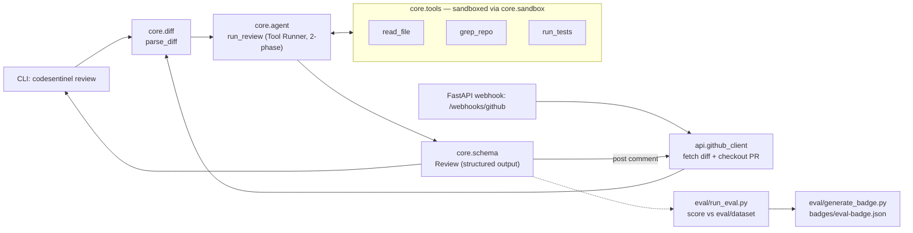

# codesentinel

[](https://github.com/akil-pat/codesentinel/actions/workflows/ci.yml)
[](eval/dataset/RUBRIC.md)

An LLM code-review agent that reviews git diffs using Claude with tool use
(reading surrounding files, searching the repo, running tests), scored
against a labeled evaluation set instead of just demoed on one example.
Usable as a CLI (`codesentinel review diff.patch`) or as a GitHub webhook
service that reviews pull requests automatically.

> **Eval status:** the scorer, dataset, and CI wiring are all built and
> tested, but **no cassettes have been recorded yet** — there was no live
> Anthropic API credential available while building this. The eval badge
> above will read "not yet measured" until someone with an
> `ANTHROPIC_API_KEY` runs `python -m eval.run_eval --mode record` once
> (see [Recording eval cassettes](#recording-eval-cassettes)). This is
> stated plainly rather than hidden — see
> [`eval/dataset/RUBRIC.md`](eval/dataset/RUBRIC.md) for the full
> methodology and its known limitations.

## Why this exists

Most agent portfolio projects demo "it works on my example." This one is
measured: a small labeled set of diffs (dev/test split), scored for
precision/recall/F1 with raw TP/FP/FN counts shown alongside the
percentage — never a bare number — re-run in CI so the badge reflects the
current prompt and tools, not a cherry-picked run. See
[`eval/dataset/RUBRIC.md`](eval/dataset/RUBRIC.md) for exactly what's
measured, how matching works, and what this dataset's size does and
doesn't support as evidence.

## Architecture



- **`src/codesentinel/core/`** — shared logic every entry point uses:
  - `sandbox.py` — path confinement, a ReDoS-guarded regex search, and a
    restricted subprocess runner. Every tool routes through this before
    touching disk or spawning a process.
  - `tools/` — `read_file`, `grep_repo`, `run_tests`, each built as a
    factory (`make_read_file_tool(config)`) so the sandbox config is
    bound by closure, never exposed as a model-controllable parameter.
  - `diff.py` — parses unified/git diff text via `unidiff` into
    per-file added/removed line numbers and hunk text.
  - `agent.py` — runs the Claude Tool Runner in **two phases**, not
    "tools + structured output in one loop": the installed SDK's own
    response-parsing code validates *every* text block against the
    output schema whenever `output_format` is set, with no exception
    handling — including a preamble sentence before a tool call. Phase 1
    investigates freely with tools; phase 2 makes one separate, tool-free
    call to restate the findings in schema. See the module docstring in
    `agent.py` for the full reasoning.
  - `schema.py` — the `Review`/`Finding` Pydantic models used both for
    structured output and for scoring.
- **`src/codesentinel/cli.py`** — `codesentinel review <diff-file>`.
- **`src/codesentinel/api/`** — the FastAPI webhook service:
  `webhooks.py` verifies GitHub's HMAC signature and dispatches to a
  background task; `github_client.py` fetches the PR diff, checks out
  its head commit, and posts the review back as a comment.
- **`eval/`** — `scorer.py` (precision/recall/F1), `run_eval.py`
  (replay/record/live modes), `generate_badge.py`, and
  `dataset/` (the labeled cases + `RUBRIC.md`).

## Security model

The agent's tools act on model-supplied input (paths, regex patterns, a
test target) that's ultimately shaped by untrusted diff content — a PR
description or code comment can try to steer the model. What's actually
enforced:

- **Path confinement** — `read_file`/`grep_repo` resolve every path
  against the repo root and reject `..` traversal, symlink escapes, and
  absolute paths outside it (`core/sandbox.py::resolve_within_root`).
- **Test execution is opt-in, not default** — `run_tests` refuses to run
  at all unless `SandboxConfig.allow_test_execution=True` was explicitly
  set for that run. The CLI's `--allow-tests` flag is off by default; the
  **webhook path hard-codes it to `False` with no way to enable it** —
  a webhook can be triggered by any fork's PR, so there's no path to
  auto-running arbitrary contributor-submitted test code at all.
- **Regex timeout** — every `grep_repo` match runs under a wall-clock
  timeout to guard against catastrophic backtracking (ReDoS) from a
  model- or diff-supplied pattern.
- **Webhook signature verification** — every request is checked against
  `X-Hub-Signature-256` (constant-time comparison) before the payload is
  touched at all.
- **Documented, not hidden, residual risk** — `run_sandboxed` confines
  the working directory and strips ambient credentials from the
  subprocess environment, but doesn't provide OS-level network/filesystem
  isolation on its own; a production deployment relies on the container
  boundary (see `Dockerfile`) for that. `checkout_pull_request` embeds a
  GitHub token in the clone URL (the same pattern `actions/checkout`
  uses) and redacts it from any error raised, but that doesn't close the
  gap of the token being visible to another user on the host via `ps`
  while the subprocess briefly runs — a credential-helper indirection
  would close that but was judged disproportionate to this project's
  scope. Both tradeoffs are documented in-code where the decision is made,
  not just here.

## Usage

### CLI

```bash
pip install -e .
export ANTHROPIC_API_KEY=sk-...

codesentinel review path/to/change.diff --repo /path/to/checked-out/repo
codesentinel review change.diff --json          # machine-readable output
codesentinel review change.diff --allow-tests   # only for repos you trust
```

### Webhook service

```bash
export ANTHROPIC_API_KEY=sk-...
export GITHUB_WEBHOOK_SECRET=...   # configured on the GitHub webhook
export GITHUB_TOKEN=...            # needs pull-request read + issue-comment write

uvicorn codesentinel.api.app:app --host 0.0.0.0 --port 8000
```

Configure a GitHub webhook (repo Settings → Webhooks) pointed at
`https://<host>/webhooks/github`, content type `application/json`,
events: **Pull requests**.

### Docker

```bash
docker build -t codesentinel .
docker run -p 8000:8000 \
  -e ANTHROPIC_API_KEY=sk-... \
  -e GITHUB_WEBHOOK_SECRET=... \
  -e GITHUB_TOKEN=... \
  codesentinel
```

## Development

```bash
python3.11 -m venv .venv && source .venv/bin/activate
pip install -e ".[dev]"

ruff check .
pytest
```

### Recording eval cassettes

The eval suite runs against recorded API responses by default (no cost,
deterministic, no credential needed for CI). Recording them requires a
real key, run once by hand:

```bash
export ANTHROPIC_API_KEY=sk-...
python -m eval.run_eval --mode record --split all
```

This writes `eval/cassettes/*.yaml` (API responses, secrets scrubbed) and
a `.meta.json` sidecar per case recording the prompt/tool source hash at
record time — `--mode replay` (CI's default) warns, or with
`--strict-cassettes`, fails if a cassette's hash no longer matches the
current source, so a stale cassette can't silently score yesterday's
prompt as today's.

## License

MIT — see [LICENSE](LICENSE).
